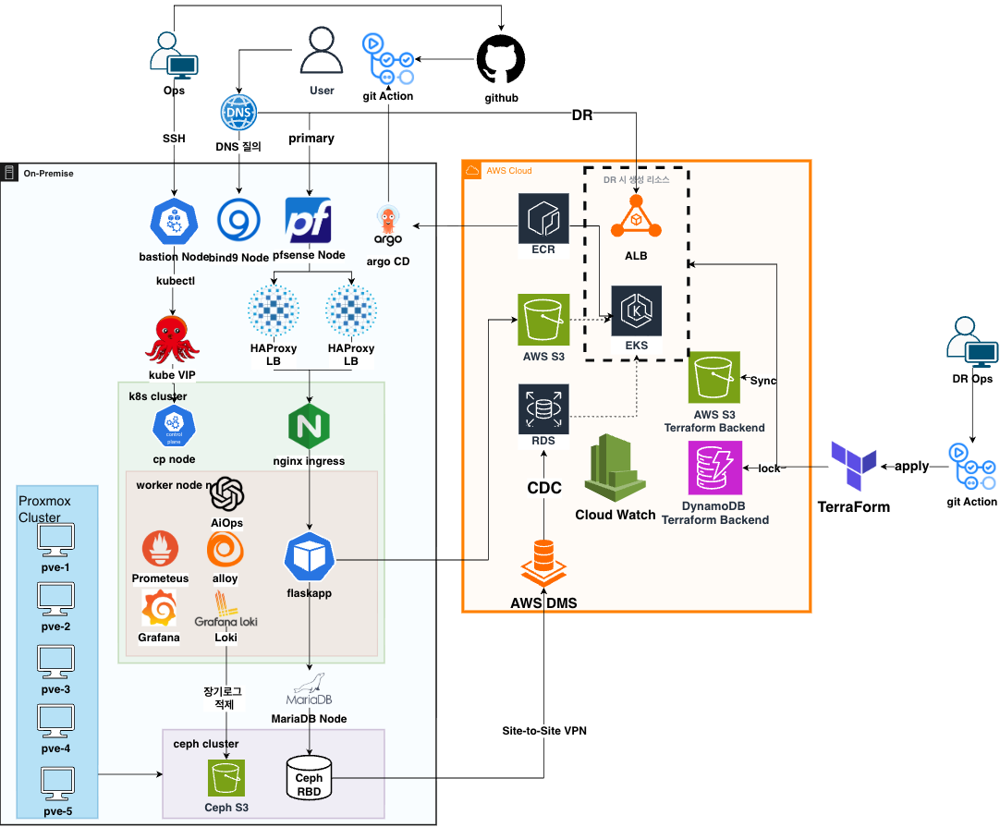

# ❄️ KOSA Team Snow

> ☁️ On-prem Kubernetes 인프라 구축과 AWS Cloud DR 설계

## 🏆 프로젝트 소개

**KOSA 한국 인공지능 소프트웨어 협회 클라우드 인프라 엔지니어 육성과정 수료 및 최종 프로젝트 대상 수상작**입니다.

- KOSA Team Snow는 5대의 물리 PC 위에 Proxmox VE 클러스터를 구성하고, 그 위에서 Flask 기반 Employee Directory 애플리케이션을 운영하기 위한 Kubernetes 플랫폼을 구축한 팀 프로젝트입니다.

- 이 프로젝트의 핵심은 단순히 애플리케이션을 Kubernetes에 배포하는 것이 아닙니다. 네트워크, 스토리지, GitOps, 관측성, 데이터 복제, 장애 복구까지 실제 운영 인프라에서 필요한 흐름을 하나의 시스템으로 연결하는 것을 목표로 했습니다.

- 정상 운영은 On-prem Kubernetes에서 수행하고, 장애 상황에서는 AWS Pilot Light DR 환경을 활성화해 서비스를 복구할 수 있도록 설계했습니다.

## 🛠 Tech Stacks

**🖥️ On-prem / Virtualization**


**🌐 Network / Entry Point**


**☸️ Kubernetes Platform**


**🧩 Application / GitOps**


**🛠️ IaC / Automation**


**🗄️ Data / Storage**


**📊 Observability / AIOps**


**☁️ AWS Cloud DR**


## 🏗️ 아키텍쳐



### 🔁 데이터 복제 경로

```text
On-prem MariaDB
  -> MariaDB binlog
  -> Site-to-Site VPN
  -> AWS DMS Full Load + CDC
  -> AWS RDS MariaDB
```

### 🚨 DR 전환 경로

```text
On-prem 장애 감지
  -> 운영자 DR 선언
  -> DMS lag 및 데이터 상태 확인
  -> dr_active=true로 AWS 앱 실행 계층 활성화
  -> EKS / ALB / FlaskApp 활성화
  -> DNS를 On-prem VIP에서 AWS ALB로 전환
  -> AWS 환경에서 서비스 검증
```

## 🧭 핵심 설계 결정

#### 프로젝트는 주요 아키텍처 결정을 ADR(Architecture Decision Record)로 남기고, 설계 변경 이유와 채택 근거를 문서화했습니다.

| 결정 | 이유 |
| --- | --- |
| 🏠 정상 운영은 On-prem, 장애 복구는 AWS | 프로젝트 범위를 Hybrid Active-Active가 아니라 Disaster Recovery에 집중하기 위해서입니다. [ADR-001](https://github.com/KOSA-Team-Snow/Docs/blob/main/architecture/ADR/ADR-001-%EC%B4%88%EA%B8%B0-%EC%95%84%ED%82%A4%ED%85%8D%EC%B3%90-%EC%84%A4%EA%B3%84-%EA%B2%B0%EC%A0%95.md) |
| 🛡️ MetalLB 대신 HAProxy + Keepalived | On-prem 사용자 진입점을 Kubernetes 외부의 단일 VIP로 명확히 관리하고 장애 추적 경로를 단순화하기 위해서입니다. [ADR-002](https://github.com/KOSA-Team-Snow/Docs/blob/main/architecture/ADR/ADR-002-%EC%9D%BC%EB%B0%98-%EC%82%AC%EC%9A%A9%EC%9E%90-%EC%A7%84%EC%9E%85%EC%A0%90-%EA%B4%80%EB%A0%A8-%EA%B2%B0%EC%A0%95.md) |
| 🧭 내부 DNS는 Bind9 | 공인 On-prem IP를 사용할 수 없는 실습 환경에서 Route 53 DNS 전환을 모의하기 위해서입니다. [ADR-003](https://github.com/KOSA-Team-Snow/Docs/blob/main/architecture/ADR/ADR-003-bind9-%EC%82%AC%EC%9A%A9-%EA%B4%80%EB%A0%A8-%EA%B2%B0%EC%A0%95.md) |

## 📌 최신 구현 기준

최신 실측 기준: `2026-05-26`

| 영역 | 구현 / 테스트 완료 내용 |
| --- | --- |
| Kubernetes Cluster | 3 control plane + 5 worker node 구성 및 전체 node Ready 확인 |
| Kubernetes API HA | kube-vip 기반 API VIP `172.16.43.99:6443` 접속 검증 |
| On-prem Entry Point | HAProxy/Keepalived VIP `172.16.42.99` 기반 사용자 진입 경로 검증 |
| DNS / Ingress | `flaskapp.team.snow.internal`, `grafana.team.snow.internal` host 기반 라우팅 검증 |
| FlaskApp 배포 | ArgoCD Synced / Healthy 확인, `/info` 및 `/` HTTP 200 응답 테스트 완료 |
| App 운영 정책 | replica 2, HPA min 2 max 4, PDB minAvailable 1 적용 확인 |
| On-prem Primary DB | MariaDB VM `172.16.43.160` 연결 및 FlaskApp DB 연동 확인 |
| Kubernetes Storage | Ceph RBD CSI StorageClass 구성, Grafana PVC Bound 확인 |
| Monitoring / Logging | Prometheus, Grafana, Alertmanager, Loki, Alloy 주요 Pod Running 확인 |
| AIOps | HolmesGPT Pod Running 및 Alert 분석 기반 구성 확인 |
| AWS DR 기반 | VPC, VPN, RDS, DMS, S3, ECR 구성 완료 |
| AWS VPN / DMS | Site-to-Site VPN tunnel 2개 UP, DMS task running 확인 |
| Pilot Light DR | 평시 EKS/ALB 비활성 상태 유지, `dr_active=true` 전환 기반 DR 앱 계층 활성화 설계 완료 |
| GitOps / Terraform 자동화 | Terraform으로 DR 기반 AWS 리소스 자동 배포 테스트 성공 |
| DR 시나리오 검증 | `dr_active=true` 전환 기반 DR 앱 계층 활성화 테스트 완료 **RTO 30분, RPO 5분 목표 달성** |

## 📦 레파지토리 구성

| Repository | 역할 |
| --- | --- |
| [Flaskapp](https://github.com/KOSA-Team-Snow/Flaskapp) | Flask 애플리케이션 소스, Dockerfile, 실행 의존성 |
| [infra](https://github.com/KOSA-Team-Snow/infra) | Proxmox 자동화, Ansible, Kubernetes, Helm, ArgoCD, AWS Terraform 코드 |
| [Docs](https://github.com/KOSA-Team-Snow/Docs) | 아키텍처, ADR, 구축 기록, 운영 Runbook, 트러블슈팅, 발표 자료 |
| [.github](https://github.com/KOSA-Team-Snow/.github) | Organization profile README 및 공통 GitHub 메타데이터 |

## 📚 문서화

프로젝트를 빠르게 이해하려면 아래 문서부터 읽는 것을 권장합니다.

| 문서 | 내용 |
| --- | --- |
| [Latest System Overview](https://github.com/KOSA-Team-Snow/Docs/blob/main/current/latest-system-overview-2026-05-26.md) | 현재 구현 기준 전체 시스템 요약 |
| [Full Verification Assessment](https://github.com/KOSA-Team-Snow/Docs/blob/main/current/full-verification-assessment-2026-05-26.md) | 영역별 실측 검증 결과와 리스크 |
| [Current Architecture Summary](https://github.com/KOSA-Team-Snow/Docs/blob/main/architecture/current-architecture-summary.md) | 최신 아키텍처 흐름과 기준 |
| [ADR Index](https://github.com/KOSA-Team-Snow/Docs/blob/main/architecture/ADR/README.md) | 채택된 아키텍처 의사결정 기록 |
| [AWS DR Architecture](https://github.com/KOSA-Team-Snow/Docs/blob/main/aws/aws-architecture-final.md) | AWS Pilot Light DR 설계와 책임 경계 |
| [Kubernetes Operations](https://github.com/KOSA-Team-Snow/Docs/blob/main/operation/k8s/README.md) | GitOps, Ingress, DB/S3 연결, 운영 정책 Runbook |
| [Monitoring Operations](https://github.com/KOSA-Team-Snow/Docs/blob/main/operation/monitoring/README.md) | Monitoring, Logging, HolmesGPT AIOps 운영 기준 |
| [Setup Guide](https://github.com/KOSA-Team-Snow/Docs/blob/main/setup/README.md) | Proxmox, Ceph, VM template, Terraform, Ansible 구축 기록 |

## 🤝 협업 방식

- 작업은 GitHub Issue, GitHub Project, 정/부 리뷰 체계, PR Template, 문서 기반 의사결정 기록을 중심으로 관리했습니다.

- GitHub Project를 팀 공용 작업 보드로 사용해 각 repository의 이슈를 한곳에서 추적했습니다. 작업은 `Backlog`, `Ready`, `In Progress`, `Review`, `Blocked`, `Done` 흐름으로 관리했고, 진행 중 막힌 작업은 Project 보드에서 상태를 바꿔 후속 조치와 담당자 follow-up이 이어지도록 운영했습니다.

### 🧑‍💻 트랙

| 트랙 | 주요 책임 | 담당자 |
| --- | --- | --- |
| On-prem Foundation | Proxmox, pfSense, VLAN, Ceph, VM template | 정: 권순호 부: 안지오 |
| Kubernetes Platform | kubeadm HA cluster, Calico, ingress-nginx, node policy | 정: 안지오 부: 이민희 |
| Application / GitOps | FlaskApp container, ECR, Helm, ArgoCD rollout | 정: 이민희 부: 정현욱 |
| Data / Observability | MariaDB, DMS source readiness, exporters, monitoring/logging | 정: 정현욱 부: 최재혁 |
| AWS DR | VPC, VPN, RDS, DMS, S3, ECR, EKS/ALB activation | 정: 최재혁 부: 권순호 |

### 🗂️ WBS 문서화

- [15 Working Days Technical WBS](https://github.com/KOSA-Team-Snow/Docs/blob/main/github/wbs.md)
